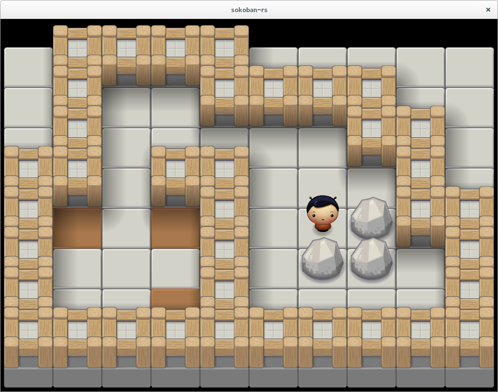

# sokoban-rs

This is an implementation of Sokoban in the [Rust Programming Language](https://www.rust-lang.org).

An example level:

## Build Instructions

Before building `sokoban-rs`, you will need to install the developpement libraries for [SDL2](https://www.libsdl.org), preferably with the package manager that comes
with your operating system.

Example for Debian/Ubuntu:

    sudo apt-get install libsdl2-dev libsdl2-image-dev libsdl2-ttf-dev

Example for Mac OSX

    brew install sdl2 sdl2_image sdl2_ttf

You might also like to read the README for these projects:

- <https://github.com/AngryLawyer/rust-sdl2>
- <https://github.com/xsleonard/rust-sdl2_image>
- <https://github.com/andelf/rust-sdl2_ttf>

To build `sokoban-rs`, type the following commands:

    git clone https://github.com/swatteau/sokoban-rs
    cd sokoban-rs
    cargo build --release

## How to Play

This game is released without any level. You can download level collections from <http://www.sourcecode.se/sokoban/levels> in the SLC (XML) format. For a quick start, try this:

    wget http://www.sourcecode.se/sokoban/download/microban.slc
    cargo run --release -- microban.slc

- Use the arrow keys to move the player.
- Type `R` to retry the current level.
- Type `N` to skip the current level.

## Graphics Options

By default, the game will start in 1024x768 windowed mode.
You can modify the width and height of the window as well as switch to fullscreen mode.

Example:

    cargo run --release -- microban.slc --width=1920 --height=1080 --fullscreen

## Credits

- [Planet Cute](http://www.lostgarden.com/2007/05/dancs-miraculously-flexible-game.html) art by Daniel Cook (Lostgarden.com)
- Ruji's Handwriting Font by Ruji C. (rujic.net)

## License

    Copyright 2015-2018 Sébastien Watteau

    Licensed under the Apache License, Version 2.0 (the "License");
    you may not use this file except in compliance with the License.
    You may obtain a copy of the License at

        http://www.apache.org/licenses/LICENSE-2.0

    Unless required by applicable law or agreed to in writing, software
    distributed under the License is distributed on an "AS IS" BASIS,
    WITHOUT WARRANTIES OR CONDITIONS OF ANY KIND, either express or implied.
    See the License for the specific language governing permissions and
    limitations under the License.
